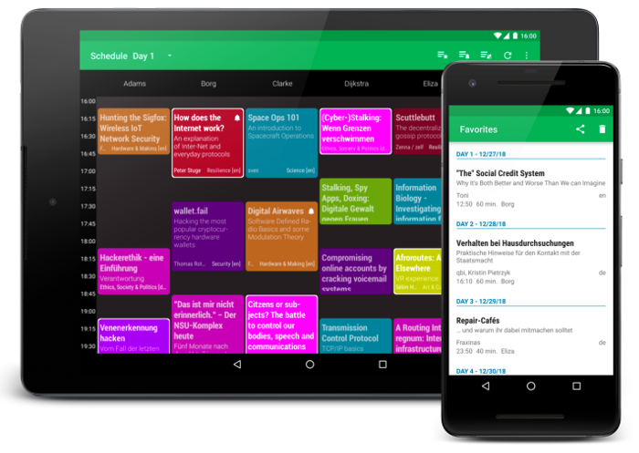

[](https://travis-ci.org/EventFahrplan/EventFahrplan) [](http://choosealicense.com/licenses/apache-2.0/)

# EventFahrplan

EventFahrplan is a viewer for event schedules for instance
[Chaos Computer Club e.V. events][ccc-events] such as Chaos Communication Camp
or Chaos Communication Congress.

The app is available for Android devices.

Bug reports, feature requests can be submitted as an [issue][issue].
Please read the instructions in the [contribution guide](CONTRIBUTING.md) in order to contribute to this project.



## Table of contents

- [Features](#features)
- [Event data](#event-data)
- [Build instructions](#build-instructions)
- [History](#history)
- [Licenses](#licenses)

## Features

* Daily overview of events
* Read abstracts, descriptions of events
* Add events to favorites list
* Export favorites list
* Setup alarms for individual events
* Add events to your personal calendar
* Share a link to an event with others
* Supported languages: English, German, French, Portuguese (event descriptions excluded)

## Event data

* The app is designed to consume event data published in a specific format
as provided by [Frab][frab-github]. The file format produced by the predecessor software,
[Pentabarf][pentabarf-github], cannot be consumed out of the box.
* In general it is possible to re-deployed the app for other events which
provide the same event file format.

## Build instructions

Before importing this project in Android Studio.

In the `app` folder make a copy of the `gradle.properties.example` file and rename it as `gradle.properties`.
This file contains the signing information which is used in the build process.

## History

* The project was started as ["CampFahrplan"][campfahrplan-github] in 2011 and has been developed
by [Daniel Dorau][tuxmobil-github]. He published the app for Chaos Communication Camp
and Chaos Communication Congress in the following years. The app served as a digital
schedule for thousands of users.
* In 2013, [Tobias Preuss][johnjohndoe-github] started contributing. Soon after he
started to redeploy the app for other events such as FOSSGIS, FrOSCon, MRMCD and
other conferences.
* In August 2017 the project moved to a new location and was renamed to
["EventFahrplan"][eventfahrplan-github] to acknowledge its broader usage.


## Licenses

Portions Copyright 2008-2011 The K-9 Dog Walkers and 2006-2011 the Android Open Source Project.


```
Copyright 2013-2019 johnjohndoe
Copyright 2011-2015 Daniel Dorau
Contributions from Adriano Pereira Junior, Akarsh Seggemu, Andy Scherzinger, Andreas Schildbach,
bashtian, bjoernb, ButterflyOfFire, cacarrara, Caio Volpato, cketti, codingcatgirl, entropynil,
koelnkalkverbot, ligi, Mateus Baptista, MichaelRocks, Noemis, Poschi, Sjors van Mierlo,
Stefan Medack, SubOptimal, Torsten Grote, Vladimir Alabov

Licensed under the Apache License, Version 2.0 (the "License");
you may not use this file except in compliance with the License.
You may obtain a copy of the License at

    http://www.apache.org/licenses/LICENSE-2.0

Unless required by applicable law or agreed to in writing, software
distributed under the License is distributed on an "AS IS" BASIS,
WITHOUT WARRANTIES OR CONDITIONS OF ANY KIND, either express or implied.
See the License for the specific language governing permissions and
limitations under the License.
```

[campfahrplan-github]: https://github.com/tuxmobil/CampFahrplan
[ccc-events]: http://events.ccc.de
[eventfahrplan-github]: https://github.com/EventFahrplan/EventFahrplan
[frab-github]: https://github.com/frab/frab
[johnjohndoe-github]: https://github.com/johnjohndoe
[pentabarf-github]: https://github.com/nevs/pentabarf
[tuxmobil-github]: https://github.com/tuxmobil/CampFahrplan
[issue]: https://github.com/EventFahrplan/EventFahrplan/issues

