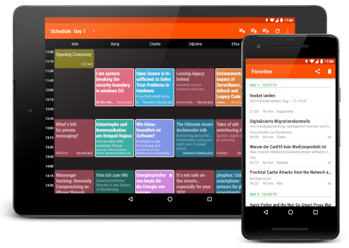

[](https://app.travis-ci.com/EventFahrplan/EventFahrplan) [](https://github.com/EventFahrplan/EventFahrplan/actions/workflows/build.yaml) [](https://crowdin.com/project/eventfahrplan) [](http://choosealicense.com/licenses/apache-2.0/)

# EventFahrplan

EventFahrplan is a viewer for event schedules for instance
[Chaos Computer Club e.V. events][ccc-events] such as [Chaos Communication Camp][camp-website],
[Chaos Communication Congress][congress-website] or [JahresEndVeranstaltungen][jev-website].

- Chaos Communication Camp Schedule app: [F-Droid][camp-app-fdroid], [Google Play][camp-app-google-play]
- Chaos Communication Congress Schedule app: [F-Droid][congress-app-fdroid], [Google Play][congress-app-google-play]
- JahresEndVeranstaltungen Schedule app: [F-Droid][jev-app-fdroid], [Google Play][jev-app-google-play]

The app is available for Android devices.

Bug reports, feature requests can be submitted as an [issue][issues-github].
Please read the instructions in the [contribution guide](CONTRIBUTING.md) in order to contribute to this project.



## Table of contents

- [Features](#features)
- [Android versions](#android-versions)
- [Event data](#event-data)
- [Build instructions](#build-instructions)
- [History](#history)
- [Licenses](#licenses)

## Features

* View program by day and rooms (side by side)
* Custom grid layout for smartphones (**try landscape mode**) and tablets
* Read detailed descriptions (speaker names, start time, room name, links, ...) of events
* Add events to favorites list
* Export favorites list
* Setup alarms for individual events
* Add events to your personal calendar
* Share a link to an event with others
* Keep track of program changes
* Automatic program updates (configurable in settings)


### Supported languages
*Event descriptions excluded*
- Dutch 🇳🇱
- English 🇺🇸
- French 🇫🇷
- German 🇩🇪
- Italian 🇮🇹
- Japanese 🇯🇵
- Polish 🇵🇱
- Portuguese 🇵🇹
- Russian 🇷🇺
- Spanish 🇪🇸
- Swedish 🇸🇪

### Optional integration

* The feedback system of [Frab][frab-website] and [Pretalx][pretalx-website]
* [c3nav][c3nav-github] - An indoor navigation project
* [Engelsystem][engelsystem-website] - Online tool for coordinating helpers and shifts on large events
* [Chaosflix][chaosflix-github] - Android app for media.ccc.de, share Fahrplan favorites with Chaosflix to import them as bookmarks


## Android versions

The application is designed to work both on smartphones and on tablets.
Android 4.1 (Jelly Bean) and newer versions are supported.


## Event data

* The app is designed to consume event data published in a specific format
as provided by [Frab][frab-website], [Pretalx][pretalx-website] or [Wafer][wafer-website].
The file format produced by the predecessor software, [Pentabarf][pentabarf-github],
cannot be consumed out of the box.
* In general it is possible to re-deployed the app for other events which
provide the same event file format.

## Build instructions

To start development open the project in Android Studio.

The [customization guide][customization-guide] explains in all details how to create an app for your event.

If you want to create your own signed release builds, copy the `gradle.properties.example` file in the `app` folder
and rename it to `gradle.properties`. This file contains the signing information which is used in the build process.
Make sure to edit the file contents to point to your own keystore files.

## History

* The project was started as ["CampFahrplan"][campfahrplan-github] in 2011 and has been developed
by [Daniel Dorau][tuxmobil-github]. He published the app for Chaos Communication Camp
and Chaos Communication Congress in the following years. The app served as a digital
schedule for thousands of users.
* In 2013, [Tobias Preuss][johnjohndoe-github] started contributing. Soon after he
started to redeploy the app for other events such as FOSSGIS, FrOSCon, MRMCD and
other conferences.
* In August 2017 the project moved to a new location and was renamed to
["EventFahrplan"][eventfahrplan-github] to acknowledge its broader usage.


## Licenses

Portions Copyright 2008-2011 The K-9 Dog Walkers and 2006-2011 the Android Open Source Project.


```
Copyright 2013-2022 johnjohndoe
Copyright 2011-2015 Daniel Dorau
Contributions from 0x5ubt13, Adriano Pereira Junior, Akarsh Seggemu,
Andrea Marziali, Andy Scherzinger, Andreas Schildbach, Animesh Verma,
bashtian, bjoernb, Björn Olsson Jarl, ButterflyOfFire, cacarrara,
Caio Volpato, Chase, cketti, codingcatgirl, Dominik Stadler, entropynil,
ideadapt, isi_ko404, Jasper van der Graaf, Joergi, koelnkalkverbot,
Larissa Yasin, ligi, Luis Azcuaga, Mateus Baptista, Matthias Geisler,
Matthias Hunstock, Matthias Mair, MichaelRocks, Nghiem Xuan Hien,
NiciDieNase, Noemis, Omicron, Poschi, rotrot, Sjors van Mierlo,
Stefan Medack, SubOptimal, Teeranai.P, Torsten Grote, Victor Herasme,
Vladimir Alabov, Yanicka

Licensed under the Apache License, Version 2.0 (the "License");
you may not use this file except in compliance with the License.
You may obtain a copy of the License at

    http://www.apache.org/licenses/LICENSE-2.0

Unless required by applicable law or agreed to in writing, software
distributed under the License is distributed on an "AS IS" BASIS,
WITHOUT WARRANTIES OR CONDITIONS OF ANY KIND, either express or implied.
See the License for the specific language governing permissions and
limitations under the License.
```

[c3nav-github]: https://github.com/c3nav
[campfahrplan-github]: https://github.com/tuxmobil/CampFahrplan
[camp-app-fdroid]: https://fdroid.gitlab.io/ccc/
[camp-app-google-play]: https://play.google.com/store/apps/details?id=info.metadude.android.cccamp.schedule
[camp-website]: https://events.ccc.de/camp/
[ccc-events]: http://events.ccc.de
[chaosflix-github]: https://github.com/NiciDieNase/chaosflix
[congress-app-fdroid]: https://f-droid.org/packages/info.metadude.android.congress.schedule
[congress-app-google-play]: https://play.google.com/store/apps/details?id=info.metadude.android.congress.schedule
[congress-website]: https://events.ccc.de/congress/
[customization-guide]: docs/CUSTOMIZING.md
[engelsystem-website]: https://engelsystem.de
[eventfahrplan-github]: https://github.com/EventFahrplan/EventFahrplan
[frab-website]: https://frab.github.io/frab/
[issues-github]: https://github.com/EventFahrplan/EventFahrplan/issues
[johnjohndoe-github]: https://github.com/johnjohndoe
[pentabarf-github]: https://github.com/nevs/pentabarf
[pretalx-website]: https://pretalx.com
[jev-app-fdroid]: https://f-droid.org/packages/info.metadude.android.rc3.schedule
[jev-app-google-play]: https://play.google.com/store/apps/details?id=info.metadude.android.rc3.schedule
[jev-website]: https://events.ccc.de/2022/11/28/dezentral-2022/
[tuxmobil-github]: https://github.com/tuxmobil
[wafer-website]: https://wafer.readthedocs.io
