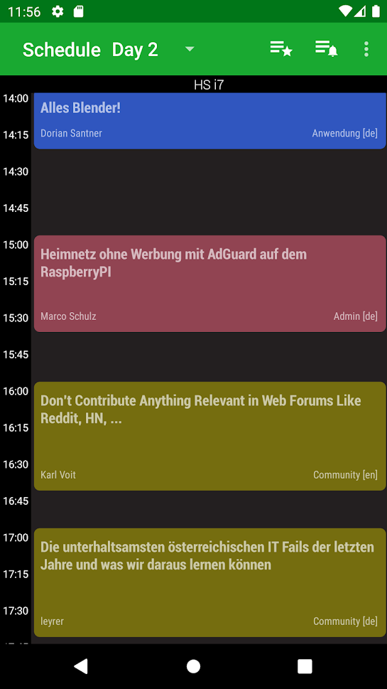

 [](https://github.com/linuxtage/EventFahrplan/actions/workflows/build.yaml) [F-Droid release version](https://img.shields.io/f-droid/v/at.linuxtage.companion.svg?logo=F-Droid) [](https://crowdin.com/project/eventfahrplan) [](http://choosealicense.com/licenses/apache-2.0/)

# EventFahrplan

This is the schedule browser for the "[Grazer Linuxtage](https://linuxtage.at)" conference in Graz, Austria.

[](https://f-droid.org/packages/at.linuxtage.companion/)
[](https://play.google.com/store/apps/details?id=at.linuxtage.companion)

It is a fork of the [EventFahrplan](https://github.com/EventFahrplan/EventFahrplan), which is a viewer for event schedules.
The app is available for Android devices.

Bug reports, feature requests can be submitted as an [issue][issues-github].
Please read the instructions in the [contribution guide](CONTRIBUTING.md) in order to contribute to this project.



## Table of contents

- [Features](#features)
- [Android versions](#android-versions)
- [Event data](#event-data)
- [Build instructions](#build-instructions)
- [Update instructions](#update-instructions)
- [Translations](#translations)
- [History](#history)
- [Funding](#funding)
- [Licenses](#licenses)

## Features

* View program by day and rooms (side by side)
* Custom grid layout for smartphones (**try landscape mode**) and tablets
* Read detailed descriptions (speaker names, start time, room name, links, ...) of events
* Add events to favorites list
* Export favorites list
* Setup alarms for individual events
* Add events to your personal calendar
* Share a link to an event with others
* Keep track of program changes
* Automatic program updates (configurable in settings)


### Supported languages
*Event descriptions excluded*
- Danish 🇩🇰
- Dutch 🇳🇱
- English 🇺🇸
- Finnish 🇫🇮
- French 🇫🇷
- German 🇩🇪
- Italian 🇮🇹
- Japanese 🇯🇵
- Lithuanian 🇱🇹
- Polish 🇵🇱
- Portuguese 🇵🇹
- Russian 🇷🇺
- Spanish 🇪🇸
- Swedish 🇸🇪

### Optional integration

* The feedback system of [Pretalx][pretalx-website]

## Android versions

The application is designed to work both on smartphones and on tablets.
Android 5.0 (Lollipop) and newer versions are supported.


## Event data

* The app is designed to consume event data published in a specific format
  as provided by [Pretalx][pretalx-website].

## Build instructions

To start development open the project in Android Studio.

The [customization guide][customization-guide] explains in all details how to create an app for your event.

If you want to create your own signed release builds, copy the `gradle.properties.example` file in the `app` folder
and rename it to `gradle.properties`. This file contains the signing information which is used in the build process.
Make sure to edit the file contents to point to your own keystore files.

```
./gradlew assembleGlt22Release
```

## Update instructions
```
git clone git@github.com:<yourgithubfork_username>/EventFahrplan.git 
git remote add linuxtage https://github.com/EventFahrplan/EventFahrplan.git 
git remote add eventfahrplan https://github.com/EventFahrplan/EventFahrplan.git 
git checkout glt-2022
git pull eventfahrplan master
git tag v1.<new_version>
git push --tags
```
After the merge, go to https://github.com/linuxtage/EventFahrplan/compare/glt-2022...<yourgithubfork_username>:EventFahrplan:glt-2022


## Translations

Text translations are managed on [Crowdin][crowdin-eventfahrplan-website]. Contributions are welcome!

Sources (English) and translations are synchronized via the [Crowdin CLI tool][crowdin-cli-tool-website].
German is excluded from being managed on Crowdin as long as the maintainer is a native German speaker.
New languages must be configured in the Crowdin configuration file `crowdin.yaml` before translations
can be downloaded.

## History

* The project was started as ["CampFahrplan"][campfahrplan-github] in 2011 and has been developed
by [Daniel Dorau][tuxmobil-github]. He published the app for Chaos Communication Camp
and Chaos Communication Congress in the following years. The app served as a digital
schedule for thousands of users.
* In 2013, [Tobias Preuss][johnjohndoe-github] started contributing. Soon after he
started to redeploy the app for other events such as FOSSGIS, FrOSCon, MRMCD and
other conferences.
* In August 2017 the project moved to a new location and was renamed to
  ["EventFahrplan"][eventfahrplan-github] to acknowledge its broader usage.
* In 2022 the project was forked to be used for the Grazer Linuxtage.

## Funding

In 2023 this project was funded through the [NGI0 Entrust Fund](https://nlnet.nl/entrust), a fund
established by [NLnet](https://nlnet.nl) with financial support from the European Commission's
[Next Generation Internet](https://ngi.eu) program, under the aegis of DG Communications Networks,
Content and Technology under grant agreement No 101069594.


## Licenses

Portions Copyright 2008-2011 The K-9 Dog Walkers and 2006-2011 the Android Open Source Project.


```
Copyright 2013-2023 johnjohndoe
Copyright 2011-2015 Daniel Dorau
Contributions from 0x5ubt13, Adriano Pereira Junior, Akarsh Seggemu,
Александр Рознятовский, aligoush, Andrea Marziali, Andy Scherzinger,
Andreas Schildbach, Animesh Verma, bashtian, bjoernb, Björn Olsson Jarl,
ButterflyOfFire, cacarrara, Caio Volpato, Chase, cketti, codingcatgirl,
Dominik Stadler, entropynil, erebion, ideadapt, isi_ko404, Jasper van der Graaf,
Joergi, Julius Vitkauskas, koelnkalkverbot, Larissa Yasin, lepawa, ligi, lucadelu,
Luis Azcuaga, María Arias de Reyna, Mateus Baptista, Matthias Geisler, Matthias Hunstock,
Matthias Mair, MichaelRocks, Miguel Beltran, mtpa, Nghiem Xuan Hien, NiciDieNase,
Noemis, Omicron, Poschi, Qwertele, rotrot, Sjors van Mierlo, Stefan Medack,
SubOptimal, Teeranai.P, Torsten Grote, Victor Herasme, Vladimir Alabov, Yanicka

Licensed under the Apache License, Version 2.0 (the "License");
you may not use this file except in compliance with the License.
You may obtain a copy of the License at

    http://www.apache.org/licenses/LICENSE-2.0

Unless required by applicable law or agreed to in writing, software
distributed under the License is distributed on an "AS IS" BASIS,
WITHOUT WARRANTIES OR CONDITIONS OF ANY KIND, either express or implied.
See the License for the specific language governing permissions and
limitations under the License.
```

[customization-guide]: docs/CUSTOMIZING.md
[crowdin-eventfahrplan-website]: https://crowdin.com/project/eventfahrplan
[crowdin-cli-tool-website]: https://crowdin.github.io/crowdin-cli/
[eventfahrplan-github]: https://github.com/EventFahrplan/EventFahrplan
[issues-github]: https://github.com/linuxtage/EventFahrplan/issues
[johnjohndoe-github]: https://github.com/johnjohndoe
[pretalx-website]: https://pretalx.com
[tuxmobil-github]: https://github.com/tuxmobil
