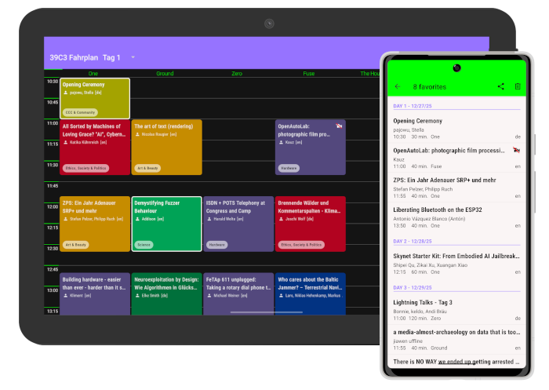

[](https://app.travis-ci.com/EventFahrplan/EventFahrplan) [](https://github.com/EventFahrplan/EventFahrplan/actions/workflows/build.yaml) [](https://crowdin.com/project/eventfahrplan) [](http://choosealicense.com/licenses/apache-2.0/)

# EventFahrplan

EventFahrplan is a viewer for event schedules such as
[Chaos Computer Club e.V. events][ccc-events] like [Chaos Communication Camp][camp-website]
or [Chaos Communication Congress][congress-website].

- Chaos Communication Camp Schedule app: [F-Droid][camp-app-fdroid], [Google Play][camp-app-google-play]
- Chaos Communication Congress Schedule app: [F-Droid][congress-app-fdroid], [Google Play][congress-app-google-play]

The app is available for Android devices.

Bug reports, feature requests can be submitted as an [issue][issues-github]. Please mind the
[limitations][limitations]. Please read the instructions in the [contribution guide](CONTRIBUTING.md)
in order to contribute to this project.



## Table of contents

- [Features](#features)
- [Android versions](#android-versions)
- [Event data](#event-data)
- [Build instructions](#build-instructions)
- [Translations](#translations)
- [History](#history)
- [Funding](#funding)
- [Licenses](#licenses)

## Features

* View program by day and rooms (side by side)
* Custom grid layout for smartphones (**try landscape mode**) and tablets
* Read detailed descriptions (speaker names, start time, room name, links, ...) of sessions
* Search through all sessions
* Add sessions to favorites list
* Export favorites list
* Setup alarms for individual sessions
* Add sessions to your personal calendar
* Share a link to a session with others
* Keep track of program changes
* Automatic program updates (configurable in settings)
* Automatically open session URLs in the app. (only enabled for 39C3)


### Supported languages
*Session descriptions excluded*
- Danish 🇩🇰
- Dutch 🇳🇱
- English 🇺🇸
- Finnish 🇫🇮
- French 🇫🇷
- German 🇩🇪
- German, Austria 🇦🇹
- Italian 🇮🇹
- Japanese 🇯🇵
- Lithuanian 🇱🇹
- Polish 🇵🇱
- Portuguese, Brazil 🇧🇷
- Portuguese, Portugal 🇵🇹
- Russian 🇷🇺
- Spanish 🇪🇸
- Swedish 🇸🇪
- Turkish 🇹🇷

### Optional integration

* The feedback system of [Frab][frab-website] and [Pretalx][pretalx-website]
* [c3nav][c3nav-github] - An indoor navigation project
* [Engelsystem][engelsystem-website] - Online tool for coordinating helpers and shifts at large events
* [Chaosflix][chaosflix-github] - Android app for media.ccc.de, share Fahrplan favorites with Chaosflix to import them as bookmarks
* [FOSDEM room status][fosdem-room-status-website] - Current status (full/empty) of a room at FOSDEM


## Android versions

The application is designed to work on both smartphones and on tablets.
Android 5.0 (Lollipop) and newer versions are supported.


## Event data

* The app is designed to consume event data published in a [specific format][frab-schedule-xml-spec]
as provided by [Frab][frab-website], [Pretalx][pretalx-website] or [Wafer][wafer-website].
The file format produced by the predecessor software, [Pentabarf][pentabarf-github],
cannot be consumed out of the box.
* In general, it is possible to re-deploy the app for other events which
provide the same event file format.

## Build instructions

To begin development, open the project in Android Studio.

The [customization guide][customization-guide] explains in detail how to create an app for your event.

If you want to create your own signed release builds, copy the `gradle.properties.example` file in the `app` folder
and rename it to `gradle.properties`. This file contains the signing information which is used in the build process.
Be sure to edit the contents of the file to point to your own keystore files.

## Translations

Text translations are managed on [Crowdin][crowdin-eventfahrplan-website]. Your [contributions](CONTRIBUTING.md) are welcome!

Sources (English) and translations are synchronized via the [Crowdin CLI tool][crowdin-cli-tool-website].
German is excluded from being managed on Crowdin as long as the maintainer is a native German speaker.
New languages must be configured in the Crowdin configuration file `crowdin.yaml` before translations
can be downloaded. The file also contains usage examples.

## History

* The project was started in 2011 as ["CampFahrplan"][campfahrplan-github] and was developed
by [Daniel Dorau][tuxmobil-github]. He released the app for the Chaos Communication Camp
and the Chaos Communication Congress in the following years. The app served as a digital
schedule for thousands of users.
* In 2013, [Tobias Preuss][johnjohndoe-github] started contributing. Soon after he
started to re-deploy the app for other events like FOSSGIS, FrOSCon, MRMCD and
other conferences.
* In August 2017 the project moved to a new location and was renamed to
["EventFahrplan"][eventfahrplan-github] to acknowledge its broader use.

## Funding

In 2025, this project was funded through the [NGI0 Core Fund](https://nlnet.nl/core), a fund
established by [NLnet](https://nlnet.nl) with financial support from the European Commission's
[Next Generation Internet](https://ngi.eu) program, under the aegis of [DG Communications
Networks, Content and Technology](https://commission.europa.eu/about-european-commission/departments-and-executive-agencies/communications-networks-content-and-technology_en) under grant agreement
No. [101092990](https://cordis.europa.eu/project/id/101092990).

In 2023 & 2024, this project was funded by the [NGI0 Entrust Fund](https://nlnet.nl/entrust), a fund
established by [NLnet](https://nlnet.nl) with financial support from the European Commission's
[Next Generation Internet](https://ngi.eu) program, under the aegis of [DG Communications Networks,
Content and Technology](https://commission.europa.eu/about-european-commission/departments-and-executive-agencies/communications-networks-content-and-technology_en) under grant agreement 
No. [101069594](https://cordis.europa.eu/project/id/101069594).


 

## Licenses

Portions Copyright 2008-2011 The K-9 Dog Walkers and 2006-2011 the Android Open Source Project.


```
Copyright 2013-2025 johnjohndoe
Copyright 2011-2015 Daniel Dorau
Contributions from 0x5ubt13, Adriano Pereira Junior, Akarsh Seggemu,
Александр Рознятовский, aligoush, Andrea Marziali, Andrulko, Andy Scherzinger,
Andreas Schildbach, Animesh Verma, bashtian, bjoernb, Björn Olsson Jarl,
burned42, ButterflyOfFire, cacarrara, Caio Volpato, Chase, cketti, codingcatgirl,
Dominik Stadler, e4ch, entropynil, erebion, ideadapt, isi_ko404, IsoLinearCHiP,
Jasper van der Graaf, Joergi, Julius Vitkauskas, koelnkalkverbot, kpc21, Larissa Yasin,
lepawa, ligi, lucadelu, Luis Azcuaga, María Arias de Reyna, Mateus Baptista,
Matthias Geisler, Matthias Hunstock, Matthias Mair, MichaelRocks, Miguel Beltran,
mtpa, Muha Aliss, Nghiem Xuan Hien, NiciDieNase, Noemis, NWuensche, Oguz Yuksel, Omicron,
ozgurbaykal, Poschi, Qwertele, Róbert Papp, Robin Janssens, rotrot, Sjors van Mierlo,
Smarzaro, Stefan Medack, SubOptimal, Su Jade, taseret, Teeranai.P, Torsten Grote,
Victor Herasme, Vladimir Alabov, Yanicka, zadintuvas

Licensed under the Apache License, Version 2.0 (the "License");
you may not use this file except in compliance with the License.
You may obtain a copy of the License at

    http://www.apache.org/licenses/LICENSE-2.0

Unless required by applicable law or agreed to in writing, software
distributed under the License is distributed on an "AS IS" BASIS,
WITHOUT WARRANTIES OR CONDITIONS OF ANY KIND, either express or implied.
See the License for the specific language governing permissions and
limitations under the License.
```

[c3nav-github]: https://github.com/c3nav
[campfahrplan-github]: https://github.com/tuxmobil/CampFahrplan
[camp-app-fdroid]: https://f-droid.org/packages/info.metadude.android.cccamp.schedule
[camp-app-google-play]: https://play.google.com/store/apps/details?id=info.metadude.android.cccamp.schedule
[camp-website]: https://events.ccc.de/camp/
[ccc-events]: http://events.ccc.de
[chaosflix-github]: https://github.com/NiciDieNase/chaosflix
[congress-app-fdroid]: https://f-droid.org/packages/info.metadude.android.congress.schedule
[congress-app-google-play]: https://play.google.com/store/apps/details?id=info.metadude.android.congress.schedule
[congress-website]: https://events.ccc.de/congress/
[customization-guide]: docs/CUSTOMIZING.md
[crowdin-eventfahrplan-website]: https://crowdin.com/project/eventfahrplan
[crowdin-cli-tool-website]: https://crowdin.github.io/crowdin-cli/
[engelsystem-website]: https://engelsystem.de
[eventfahrplan-github]: https://github.com/EventFahrplan/EventFahrplan
[frab-schedule-xml-spec]: https://github.com/voc/schedule/tree/master/validator/xsd
[frab-website]: https://frab.github.io/frab/
[fosdem-room-status-website]: https://api.fosdem.org
[issues-github]: https://github.com/EventFahrplan/EventFahrplan/issues
[johnjohndoe-github]: https://github.com/johnjohndoe
[limitations]: docs/LIMITATIONS.md
[pentabarf-github]: https://github.com/nevs/pentabarf
[pretalx-website]: https://pretalx.com
[tuxmobil-github]: https://github.com/tuxmobil
[wafer-website]: https://wafer.readthedocs.io
