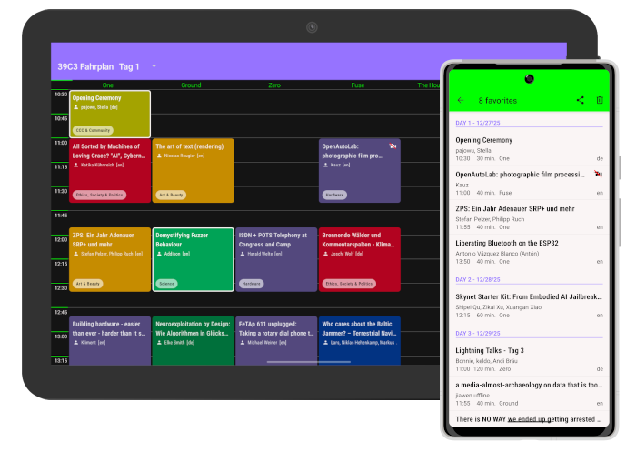

[](https://app.travis-ci.com/EventFahrplan/EventFahrplan) [](https://github.com/EventFahrplan/EventFahrplan/actions/workflows/build.yaml) [](https://crowdin.com/project/eventfahrplan) [](http://choosealicense.com/licenses/apache-2.0/)

# EventFahrplan

EventFahrplan is an open-source Android project that lets you create a branded schedule app for your
event. Configure it with your schedule data, add your own branding, and publish to F-Droid or
Google Play.

It works with event schedules published as [XML][frab-schedule-xml-spec] or
[JSON][frab-schedule-json-spec]. If your event uses [Frab][frab-website],
[Pretalx][pretalx-website], [Wafer][wafer-website] or [OpenKi][openki-website] to manage its
schedule, the data is already in the right format.

Events using EventFahrplan include [Chaos Communication Congress][congress-website],
[Chaos Communication Camp][camp-website], FOSDEM, FrOSCon, KotlinConf, and others.



## Table of contents

- [Try it out](#try-it-out)
- [Key features](#key-features)
- [Getting started](#getting-started)
- [Event data](#event-data)
- [Translations](#translations)
- [History](#history)
- [Funding](#funding)
- [Licenses](#licenses)

## Try it out

To see a real life example, download an existing EventFahrplan app to see what your event's app
could look like:

**Chaos Communication Congress Schedule**: [F-Droid][congress-app-fdroid] | [Google Play][congress-app-google-play]

## Key features

* **Schedule grid**: View the program by day and room, side by side
* **Responsive layout**: Custom grid for smartphones and tablets (try landscape mode)
* **Session details**: Speaker names, start time, room, links, and more
* **Search**: Find and filter sessions across the full schedule
* **Favorites**: Save sessions to a favorites list and export them
* **Alarms**: Set reminders for individual sessions
* **Calendar**: Add sessions to your personal calendar
* **Sharing**: Share a link to any session
* **Feedback**: Rate sessions and leave comments (via Frab or Pretalx)
* **Change tracking**: See what changed since the last schedule update
* **Auto-updates**: Schedule refreshes automatically (configurable in settings)
* **Offline**: The full schedule works without an internet connection
* **Compatibility**: Runs on Android 6.0 (Marshmallow) and newer

### Supported languages
*Session descriptions excluded*
- Danish 🇩🇰
- Dutch 🇳🇱
- English 🇺🇸
- Finnish 🇫🇮
- French 🇫🇷
- German 🇩🇪
- German, Austria 🇦🇹
- Italian 🇮🇹
- Japanese 🇯🇵
- Lithuanian 🇱🇹
- Polish 🇵🇱
- Portuguese, Brazil 🇧🇷
- Portuguese, Portugal 🇵🇹
- Russian 🇷🇺
- Spanish 🇪🇸
- Swedish 🇸🇪
- Turkish 🇹🇷

### Optional integrations

* [c3nav][c3nav-github] — Indoor navigation to session rooms
* [Engelsystem][engelsystem-website] — Volunteer shift coordination at large events
* [Chaosflix][chaosflix-github] — Share favorites with the media.ccc.de Android app
* In-app session feedback via [Frab][frab-website] or [Pretalx][pretalx-website]
* [FOSDEM room status][fosdem-room-status-website] — Live room capacity at FOSDEM

## Getting started

### Prerequisites

- [Android Studio](https://developer.android.com/studio) (current stable release)
- JDK 21
- Android SDK 36 (installed via Android Studio's SDK Manager)

### Build an existing flavor

1. Clone the repository: `git clone https://github.com/EventFahrplan/EventFahrplan.git`
2. Open the project in Android Studio
3. Wait for Gradle sync to complete
4. Select a build variant (e.g. `ccc39c3Debug`) from **Build > Select Build Variant**
5. Run on a connected device or emulator

### Create an app for your event

The project uses Android [product flavors](https://developer.android.com/build/build-variants#product-flavors)
to produce different apps from the same codebase. To create an app for your event:

1. Fork the repository and create a branch for your event
2. Add a new product flavor in `app/build.gradle.kts` (use an existing flavor as a template)
3. Set your `SCHEDULE_URL` to point to your event's XML or JSON schedule
4. Configure your `applicationId`, event name, and other properties
5. Build and run to verify your schedule loads correctly

For the full step-by-step guide, including branding, icons, colors, and optional features, see the
[customization guide][customization-guide].

### Signed release builds

To create signed release builds for publishing, copy `app/gradle.properties.example` to
`app/gradle.properties` and update it with your own keystore details.

## Event data

The supported [XML][frab-schedule-xml-spec] and [JSON][frab-schedule-json-spec] schedule formats are
described in detail in the linked specifications. The older format produced by
[Pentabarf][pentabarf-github] is not supported by default. Other formats can be added by providing
custom `ScheduleFileFormat` and `ScheduleSource` implementations.

Please mind the known [limitations]. Bug reports and feature requests can be submitted as an
[issue][issues-github]. Read the [contribution guide](CONTRIBUTING.md) before contributing.

## Translations

Text translations are managed on [Crowdin][crowdin-eventfahrplan-website]. Your [contributions](CONTRIBUTING.md) are welcome!

English source strings and translations are synchronized via the [Crowdin CLI tool][crowdin-cli-tool-website].
German is excluded from being managed on Crowdin as long as the maintainer is a native German speaker.
New languages must be configured in the Crowdin configuration file `crowdin.yaml` before translations
can be downloaded. The file also contains usage examples.

## History

* The project was started in 2011 as ["CampFahrplan"][campfahrplan-github] and was developed
by [Daniel Dorau][tuxmobil-github]. He released the app for the Chaos Communication Camp
and the Chaos Communication Congress in the following years. The app served as a digital
schedule for thousands of users.
* In 2013, [Tobias Preuss][johnjohndoe-github] started contributing and soon began
re-deploying the app for other events like FOSSGIS, FrOSCon, MRMCD and
other conferences.
* In August 2017 the project moved to a new location and was renamed to
["EventFahrplan"][eventfahrplan-github] to acknowledge its broader use.

## Funding

In 2025, this project was funded through the [NGI0 Core Fund](https://nlnet.nl/core), a fund
established by [NLnet](https://nlnet.nl) with financial support from the European Commission's
[Next Generation Internet](https://ngi.eu) program, under the aegis of [DG Communications
Networks, Content and Technology](https://commission.europa.eu/about-european-commission/departments-and-executive-agencies/communications-networks-content-and-technology_en) under grant agreement
No. [101092990](https://cordis.europa.eu/project/id/101092990).

In 2023 & 2024, this project was funded by the [NGI0 Entrust Fund](https://nlnet.nl/entrust), a fund
established by [NLnet](https://nlnet.nl) with financial support from the European Commission's
[Next Generation Internet](https://ngi.eu) program, under the aegis of [DG Communications Networks,
Content and Technology](https://commission.europa.eu/about-european-commission/departments-and-executive-agencies/communications-networks-content-and-technology_en) under grant agreement
No. [101069594](https://cordis.europa.eu/project/id/101069594).


 

## Licenses

Portions Copyright 2008-2011 The K-9 Dog Walkers and 2006-2011 the Android Open Source Project.


```
Copyright 2013-2026 johnjohndoe
Copyright 2011-2015 Daniel Dorau
Contributions from 0x5ubt13, Adriano Pereira Junior, Akarsh Seggemu,
Александр Рознятовский, aligoush, Andrea Marziali, Andreas Wirth, Andrulko, Andy Scherzinger,
Andreas Schildbach, Animesh Verma, bashtian, bjoernb, Björn Olsson Jarl,
burned42, ButterflyOfFire, cacarrara, Caio Volpato, Chase, cketti, codingcatgirl,
Dominik Stadler, e4ch, entropynil, erebion, ideadapt, isi_ko404, IsoLinearCHiP, Italo Vignoli,
Jasper van der Graaf, Joergi, Julius Vitkauskas, koelnkalkverbot, kpc21, Larissa Yasin,
lepawa, ligi, lucadelu, Luis Azcuaga, María Arias de Reyna, Mateus Baptista,
Matthias Geisler, Matthias Hunstock, Matthias Mair, MichaelRocks, Miguel Beltran,
mtpa, Muha Aliss, nautilusx, Nghiem Xuan Hien, NiciDieNase, Noemis, NWuensche, Oguz Yuksel,
Omicron, ozgurbaykal, Poschi, Qwertele, Róbert Papp, Robin Janssens, rotrot, Sebastian Zabel,
Sjors van Mierlo, Smarzaro, Stefan Medack, SubOptimal, Su Jade, taseret, tct123, Teeranai.P,
Torsten Grote, Victor Herasme, Vladimir Alabov, Yanicka, zadintuvas

Licensed under the Apache License, Version 2.0 (the "License");
you may not use this file except in compliance with the License.
You may obtain a copy of the License at

    http://www.apache.org/licenses/LICENSE-2.0

Unless required by applicable law or agreed to in writing, software
distributed under the License is distributed on an "AS IS" BASIS,
WITHOUT WARRANTIES OR CONDITIONS OF ANY KIND, either express or implied.
See the License for the specific language governing permissions and
limitations under the License.
```

[c3nav-github]: https://github.com/c3nav
[campfahrplan-github]: https://github.com/tuxmobil/CampFahrplan
[camp-website]: https://events.ccc.de/camp/
[chaosflix-github]: https://github.com/NiciDieNase/chaosflix
[congress-app-fdroid]: https://f-droid.org/packages/info.metadude.android.congress.schedule
[congress-app-google-play]: https://play.google.com/store/apps/details?id=info.metadude.android.congress.schedule
[congress-website]: https://events.ccc.de/congress/
[customization-guide]: docs/CUSTOMIZING.md
[crowdin-eventfahrplan-website]: https://crowdin.com/project/eventfahrplan
[crowdin-cli-tool-website]: https://crowdin.github.io/crowdin-cli/
[engelsystem-website]: https://engelsystem.de
[eventfahrplan-github]: https://github.com/EventFahrplan/EventFahrplan
[frab-schedule-json-spec]: https://github.com/voc/schedule/tree/master/validator/json
[frab-schedule-xml-spec]: https://github.com/voc/schedule/tree/master/validator/xsd
[frab-website]: https://frab.github.io/frab/
[fosdem-room-status-website]: https://api.fosdem.org
[issues-github]: https://github.com/EventFahrplan/EventFahrplan/issues
[johnjohndoe-github]: https://github.com/johnjohndoe
[limitations]: docs/LIMITATIONS.md
[openki-website]: https://openki.net
[pentabarf-github]: https://github.com/nevs/pentabarf
[pretalx-website]: https://pretalx.com
[tuxmobil-github]: https://github.com/tuxmobil
[wafer-website]: https://wafer.readthedocs.io
