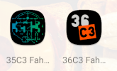
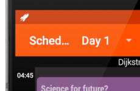
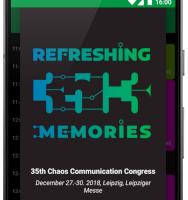
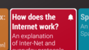
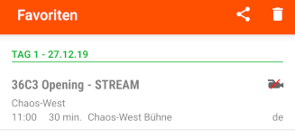
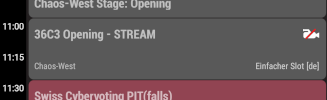
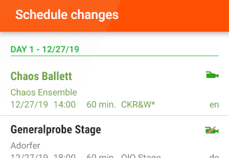

# Customization guide

This document describes how you can create your own app for an event.

## 1. Required information

The following information are needed to configure the app for your event.
This list is for your preparation. Step 3 guides you through where to fill in the information.

- Schedule URL which provides Frab compatible XML
- Session URL template, e.g. `https://awesome-event.com/2021/events/%1$s.html`
- Server backend type, one of: `pentabarf`, `frab`, `pretalx`
- Google Play URL, e.g. `https://play.google.com/store/apps/details?id=com.awesome.event.schedule`
- F-Droid URL, e.g. `https://f-droid.org/packages/com.awesome.event.schedule`
- Event URL, e.g. `https://awesome-event.com/2021`
- Start and end date of the event
- Email address for bug reports
- Social media hashtags/handles (can be empty), e.g. `#36c3 @ccc`
- Schedule feedback URL template (optional), e.g. `https://awesome-event.com/2021/events/%s/feedback/new`
- Engelsystem URL (optional), e.g. `https://engelsystem.de/awesome-event/shifts-json-export?key=YOUR_KEY`
- Name/s of the author/s of the logo(s), website URL/s optionally

## 2. Required graphic assets and colors

The following graphics and colors are needed in order to customize the look and feel of the app.
This list is for your preparation. The specific folders and files are mentioned in the next step.

- Launcher icon (SVG)

  

- Notification icon (SVG)

  

- About dialog logo (SVG)

  

- Text and background colors (HEX)
- Tracks background colors (HEX)
- Bell icon (PNG)

  

- Video recording icons (PNG)

  

  

  

## 3. Your custom app step by step

In some of the steps it is the easiest to copy and adapt configuration settings, folders and files from an existing flavor.

1. Fork the repository
2. Create a new branch for your event, e.g. `awesome-event-2021`
3. Add a new product flavor in *app/build.gradle* e.g. `awesome2021` and the corresponding folder e.g. `app/src/awesome2021`
4. Configure all required properties in your flavor (`applicationId`, `versionName`, `buildConfigField`, `resValue`)
5. Enable showing the app disclaimer via `SHOW_APP_DISCLAIMER` to acknowledge its origin
6. Add a new signing config in *app/gradle.properties*
7. Customize texts for the languages which you want to offer (`values/strings.xml`, `values-de/strings.xml`, ...)
8. Add the name/s (and website/s) of the authors of the logo(s) in *copyright_logo*
9. Add track resource names in *res/xml/track_resource_names.xml*
10. Customize track colors in *res/values/colors_congress.xml*
11. Customize app colors in *res/values/colors.xml*
12. Add a launcher icon in different resolutions as *res/mipmap-[...]/ic_launcher.png*
13. Add a notification icon in different resolutions as *res/drawable-[...]/ic_notification.png*
14. Add an about dialog logo as *res/drawable/dialog_logo.xml*
15. Customize bell and video recording icons in *res/drawable/* (optional)

## 4. Optional customization

The following options can be enabled via a `buildConfigField` and configured in *app/build.gradle* if needed.

- Social media hashtags/handles for the event via `SOCIAL_MEDIA_HASHTAGS_HANDLES`
- Alternative schedule URL via `ENABLE_ALTERNATIVE_SCHEDULE_URL`
- c3nav integration via `C3NAV_URL`
- Chaosflix export via `ENABLE_CHAOSFLIX_EXPORT`
- Engelsystem shifts via `ENABLE_ENGELSYSTEM_SHIFTS`
  - Customize Engelsystem shifts JSON export URL hint via `preference_hint_engelsystem_json_export_url`
- Feedback system via `SCHEDULE_FEEDBACK_URL`

## 5. Optional engagements

The app prompts the user to engage in the following topics if enabled via a `buildConfigField` in *app/build.gradle*.

- c3nav app installation via `ENGAGE_C3NAV_APP_INSTALLATION`
- Google Play beta testing via `ENGAGE_GOOGLE_BETA_TESTING`
- Google Play rating via `ENGAGE_GOOGLE_PLAY_RATING`
- to learn about the screen estate in landscape mode via `ENGAGE_LANDSCAPE_ORIENTATION`
