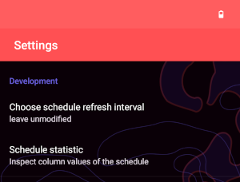

# Customization guide

This document describes how to create your own app for an event.

## 1. Required information

The following information is required to configure the app for your event.
This list is for your preparation. Step 3 guides you through where to enter the information.

- Schedule URL which provides Frab compatible XML
- Session URL template, e.g. `https://awesome-event.com/2021/events/%1$s.html`
- Server backend type, one of: `pentabarf`, `frab`, `pretalx`
- Google Play URL, e.g. `https://play.google.com/store/apps/details?id=com.awesome.event.schedule`
- F-Droid URL, e.g. `https://f-droid.org/packages/com.awesome.event.schedule`
- Event URL, e.g. `https://awesome-event.com/2021`
- Event postal address (optional), e.g. `CCH, Congressplatz 1, 20355 Hamburg`
- Start and end date of the event
- Email address for bug reports
- Social media hashtags/handles (can be empty), e.g. `#36c3 @ccc`
- Schedule feedback URL template (optional), e.g. `https://awesome-event.com/2021/events/%s/feedback/new`
- Custom name used for the Engelsystem (optional), e.g. `Trollsystem`
- Custom name used for the Engelsystem shifts (optional), e.g. `Trollshifts`
- Engelsystem URL (optional), e.g. `https://engelsystem.de/awesome-event/shifts-json-export?key=YOUR_KEY`
- Name/s of the author/s of the logo(s), website URL/s optionally

## 2. Required graphic assets and colors

The following graphics and colors are required to customize the look and feel of the app.
This list is for your preparation. The specific folders and files are mentioned in the next step.

- Launcher icon (SVG)

  

- Notification icon (SVG)

  

- About dialog logo (SVG)

  

- Text and background colors (HEX)
- Tracks background colors (HEX)
- Icons in the app bar as well as the session alarm icon (bell) can be customized via the `app_bar_action_icon` color resource.
- The alarm icon (bell) which is shown on a session can be customized via the `session_item_alarm_icon` color resource.
- The video recording icons must be customized manually because they contain more than one color.

## 3. Your custom app step by step

In some of the steps it is the easiest to copy and adapt configuration settings, folders and files from an existing flavor.

1. Fork the repository
2. Create a new branch for your event, e.g. `awesome-event-2021`
3. Add a new product flavor in *app/build.gradle* e.g. `awesome2021` and the corresponding folder e.g. `app/src/awesome2021`
4. Configure all required properties in your flavor (`applicationId`, `versionName`, `buildConfigField`, `resValue`)
5. Enable showing the app disclaimer via `SHOW_APP_DISCLAIMER` to acknowledge its origin in your flavor
6. Add a new signing config in `app/gradle.properties`
7. Customize texts for the languages which you want to offer (`values/strings.xml`, `values-de/strings.xml`, ...) in your flavor
8. Add the name/s (and website/s) of the authors of the logo(s) in `copyright_logo`
9. Add track resource names in `res/xml/track_resource_names.xml` in your flavor
10. Customize track colors in `res/values/colors_congress.xml` in your flavor - brighter colors in `res/values`, darker colors `res/values-night`
11. Customize app colors in `res/values/colors.xml` in your flavor - good default colors are defined in `app/src/main`
12. Verify colors both in light and dark modes
13. Add a launcher icon in different resolutions as `res/mipmap-[...]/ic_launcher.png` in your flavor
14. Add a notification icon in different resolutions as `res/drawable-[...]/ic_notification.png` in your flavor
15. Add an about dialog logo as `res/drawable/dialog_logo.xml` in your flavor
16. Customize bell and video recording icons in `res/drawable/` (optional) in your flavor

### 3.1. Customizing illustrations shown at empty screens

The app shows illustrations on empty screens. You can customize these illustrations which fit the
look and feel of your event by importing **your own SVG files** as vector drawables to the
`res/drawable/` folder of **your product flavor**, e.g. `app/src/awesome2021/res/drawable/`.
If the same file names are used than your illustrations will replace the default ones in `main`.
The following default illustrations (vector drawables) are present in the app:

- No alarms: `app/src/main/res/drawable/no_alarms.xml`
- No favorites: `app/src/main/res/drawable/no_favorites.xml`
- No schedule: `app/src/main/res/drawable/no_schedule.xml`
- No schedule changes: `app/src/main/res/drawable/no_schedule_changes.xml`
- No search results: `app/src/main/res/drawable/no_search_results.xml`

The original raw SVG files can be found in `assets/empty-states/`, more information is available in the
associated [README](../assets/empty-states/README.md).

## 4. Optional customization

The following options can be enabled via a `buildConfigField` and configured in *app/build.gradle* as needed.

- Event postal address for easy map navigation via `EVENT_POSTAL_ADDRESS`
- Social media hashtags/handles for the event via `SOCIAL_MEDIA_HASHTAGS_HANDLES`
- Alternative schedule URL via `ENABLE_ALTERNATIVE_SCHEDULE_URL`
- c3nav integration via `C3NAV_URL`
- Chaosflix export via `ENABLE_CHAOSFLIX_EXPORT`
- Engelsystem shifts via `ENABLE_ENGELSYSTEM_SHIFTS`
  - Customize the name for the Engelsystem via `engelsystem_alias`
  - Customize the name for the Engelsystem shifts via `engelsystem_shifts_alias`
  - Customize Engelsystem shifts JSON export URL hint via `preference_hint_engelsystem_json_export_url`
- Feedback system via `SCHEDULE_FEEDBACK_URL`
- FOSDEM room status via `ENABLE_FOSDEM_ROOM_STATUS`, `FOSDEM_ROOM_STATES_URL`, `FOSDEM_ROOM_STATES_PATH`

## 5. Optional engagements

The app prompts the user for in the following topics if enabled via a `buildConfigField` in *app/build.gradle*.

- c3nav app installation via `ENGAGE_C3NAV_APP_INSTALLATION`
- Google Play beta testing via `ENGAGE_GOOGLE_BETA_TESTING`
- Google Play rating via `ENGAGE_GOOGLE_PLAY_RATING`
- to learn about the screen estate in landscape mode via `ENGAGE_LANDSCAPE_ORIENTATION`

## 6. Development features

The following features are available when the build type is "debug". They are located in the
"Development" section of the "Settings" screen. They are intended for the preparation phase of the
app to verify that the schedule data is loaded and processed correctly.

### Schedule refresh interval

The "Choose schedule refresh interval" option allows to overwrite the default refresh interval
which is configured internally. This can be useful to test if schedule loading and processing works
in general. Additionally, the correct recognition of schedule changes can quickly be verified
without waiting for the next scheduled refresh.

To simulate a schedule change, this
[Python script](https://gist.github.com/johnjohndoe/b2a067c0557dd1122b16b09650498adb) becomes handy.

1. Prepare two schedule files with different session information
2. Put the script and the two schedule files on a webserver of your choice
3. Let a cronjob run the script to copy one of the two files to a specified public webserver directory
4. Configure the webserver URL as the `SCHEDULE_URL` for the correct build flavor in the `app/build.gradle` file

### Schedule statistic

The "Schedule statistic" screen shows the distribution of null or empty and non-empty fields in
the "sessions" database table. This can be useful for identifying missing data in the schedule.

## 7. App links

You can configure [app links](https://developer.android.com/training/app-links/about) to immediately
open the corresponding session details screen when tapping website URLs. This requires the following
steps:

1. Add a [digital asset links](https://developer.android.com/training/app-links/configure-assetlinks) file
   to the domain of the event, e.g. https://myconferen.ce/.well-known/assetlinks.json.
   - The server must  respond with `HTTP 200 OK` - otherwise the "open supported links" option will
     be toggled off by default.
   - Add separate certificate fingerprints for your Google Play and F-Droid publications if they
     don't share the same signing key.
   - Add the certificate fingerprint of your debug key store which becomes handy during development.
2. Configure the [intent filter pattern](https://developer.android.com/training/app-links/add-applinks)
   in the `AndroidManifest.xml` of your product flavor.
   - Add `android:autoVerify="true"`. Without `autoVerify`, Android will never enable supported links automatically.
   - Configure the domain(s), subdomain(s) and path(s) to be handled.
3. The correct session details might still not open automatically. Check *logcat's* output for error messages.
   You might need to add the missing URL path in `SlugFactory` and `SlugFactoryTest`.

